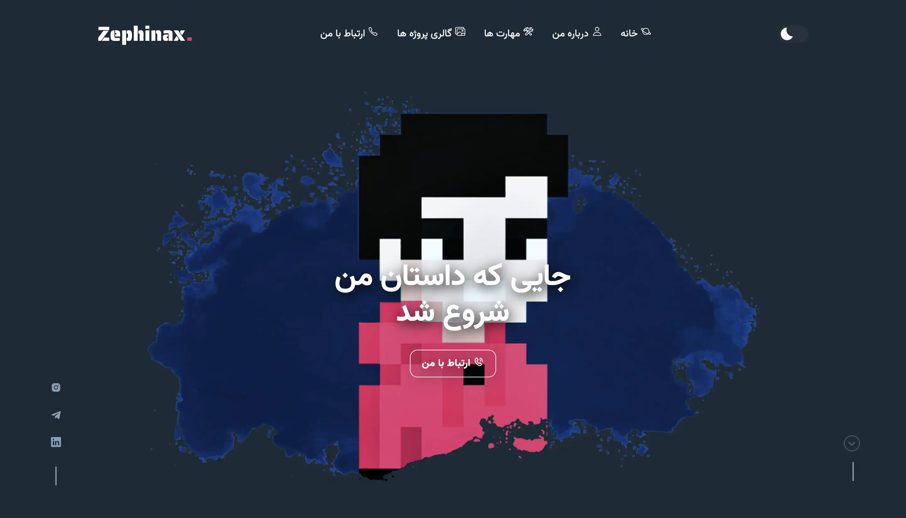
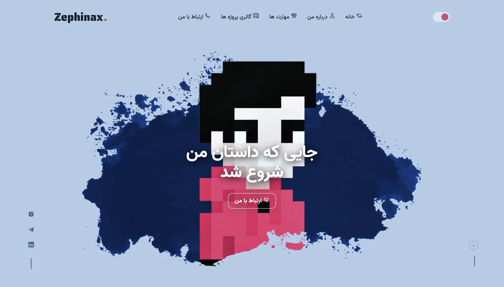

<h2 align="center">
  Portfolio Website - v1.2 
  <a href="https://Zephinax.ir/" target="_blank">Click Here To Show Demo [Zephinax.ir]</a>
</h2>
 

 

 &nbsp;
 &nbsp;
 &nbsp;

<h3 align="center">
    🔹
    <a href="https://github.com/Zephinax/Portfolio/issues">Report Bug</a> &nbsp; &nbsp;
    🔹
    <a href="https://github.com/Zephinax/Portfolio/issues">Request Feature</a>
</h3>

## How to use?

1 - Fork this repo to modify and make changes of your own.

2 - To active form, go to [Web3forms](https://web3forms.com) and click on [ Create Your Access Key ]
and enter your email to generate your access key, then search for [ hidden ] in index.html and change vaule with your access key

## Features

- 📱 Fully Responsive

- 🖇️ Working Contact Form

- 📖 Multi-Page Layout

- 🔅 Dark & Light Mode

- 💄 Fully Customizable

Give a ⭐ if you like this project!

## Authors

- [@Zephinax](https://github.com/Zephinax)

  Please give me proper credit by linking back to [Zephianx](https://github.com/Zephinax). Thanks!
